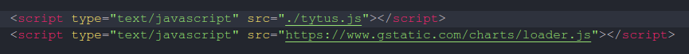

Manual técnico
=====================================

### Descripción de la implementación
La implementación consta de 3 requerimientos importantes los cuales son:

- Carga de archivos 
- Eleccion de modelo
- Mostrar graficas

### 1. Carga de archivos
Para esta seccion se utilizo el la instancia FileReader que nos permite leer un archivo en varias formatos. En este caso se utilizo una lectura como texto y no como valores en datos crudos como Buffer de datos serializados.

  

Como se puede observar despues de crear la instancia se pasa como parametro una funcion anonima que recibe el evento, en este caso sera el cuando cambie el estado de la variable reader.

### 2. Eleccion de modelo
Para la eleccion del modelo se utilizo un select de html. Seguidamente este invoca a una funcion segun sea el caso, haciendo uso de la libreria Tytus.js que fue la libreria que ejecuta toda la logica de los modelos según los datos parametrizados.

  

Como se puede observar aqui se crea una instancia de la clase LinearRegression se trata basicamente de la regresion lineal. En este caso se carga las variables x e y, luego se pasan al modelo para sus posterior procesamiento.

### 3. Graficación
Para este caso se utilizo la herramienta de google para graficar y observar los resultados de cada uno de los modelos llamada gstatic. Simplemente se importo en la etiqueta **script** de html.

  

Aqui se observa como se agrego tanto el archivo tytus.js como la herramienta de graficación.
