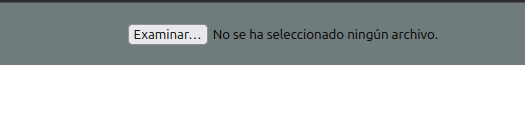
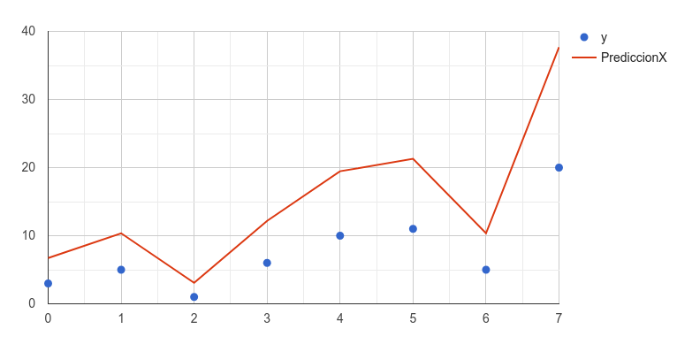

Manual de usuario 
====================

### Descripcion de la aplicación
La aplicación consiste en realizar modelos de predicción, entrenamiento, basado en datos que se pasan al modelo a través de archivos csv que son mas que datos delimitados por comas.

### Pasos para utilizar la aplicación
#### 1. Carga de archivos csv
Para cargar un archivo presiona el boton examinar y busque el archivo correspondiente. Este debe ser en formato csv y manejando la siguiente estructura.
<table align="center">
    <tr>
        <th>x</th>
        <th>y</th>
    </tr>
    <tr>
        <td>1</td>
        <td>4</td>
    </tr>
    <tr>
        <td>2</td>
        <td>6</td>
    </tr>
    <tr>
        <td>7</td>
        <td>3</td>
    </tr>
    <tr>
        <td>9</td>
        <td>11</td>
    </tr>
    <tr>
        <td>3</td>
        <td>1</td>
    </tr>
    <tr>
        <td>2</td>
        <td>4</td>
    </tr>
</table>

  

#### 2. Selección de modelo de predicción
Una vez cargados el archivo con los datos, elija el modelo que desee. Al indicar el modelo, se visualizarán los resultados para los valores especificados.

  

#### 3. Mostrar graficas
Si desea observar las graficas que fueron generadas con los datos que inicialmente proporcionó. Para ello oprima el boton **Mostrar graficas** y observará algo parecido a esto.

  

